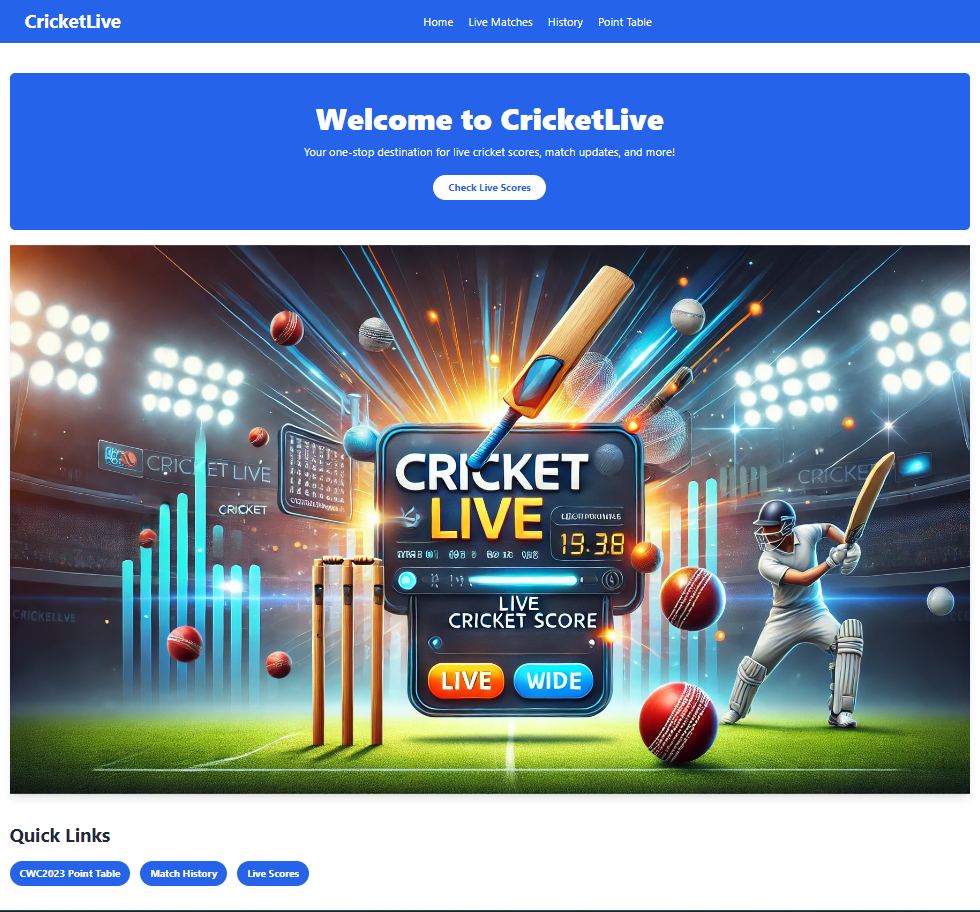

# CricketLive 🏏

CricketLive is a full-stack web application that provides real-time cricket match updates, scores, match details, and points table of the ongoing Cricket World Cup. The application is built using Angular for the frontend, Spring Boot for the backend, and PostgreSQL as the database.

## Features 🚀

- Live cricket score updates, fetched using web scraping with Jsoup.
- Real-time match details and points table of the Cricket World Cup.
- Full-stack architecture with REST APIs.
- Modern UI built with Tailwind CSS for responsive design.

## Tech Stack 🛠️

- **Frontend**: Angular 18, Tailwind CSS
- **Backend**: Spring Boot (Java)
- **Database**: PostgreSQL
- **Web Scraping**: Jsoup

## Live Demo 🔗

Check out the live application: [CricketLive](https://ab-cricketlive-sar.netlify.app/)

## Project Snapshot 📸

In case the live website is unavailable, here’s a preview of the application:

# Home Page  

# Live Scores Page  

# All Matches Page  

# Point Table  

## Installation and Setup 💻

### Prerequisites

- Java 11 or higher
- Node.js and npm
- PostgreSQL (for local development)
- Maven (for backend)

## Contributing 🛠️

1. Fork the repository.
2. Create your feature branch (`git checkout -b feature/AmazingFeature`).
3. Commit your changes (`git commit -m 'Add some AmazingFeature'`).
4. Push to the branch (`git push origin feature/AmazingFeature`).
5. Open a Pull Request.

## License 📄

This project is licensed under the MIT License - see the [LICENSE](LICENSE) file for details.

## Acknowledgements 🙌

- Special thanks to all libraries, frameworks, and resources that made this project possible.
